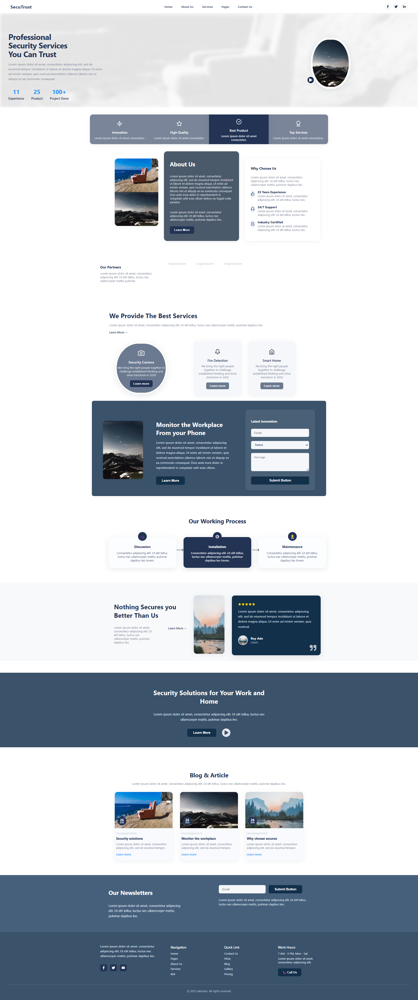

# React Landing Page Project



A modern, responsive landing page built with React and Vite. This project showcases a professional business website with multiple sections including hero, services, testimonials, and more.

## 👨‍💻 Author
**ofsaksham**

## 🚀 Features

- **Modern React 19** with latest features
- **Responsive Design** that works on all devices
- **Component-Based Architecture** for maintainable code
- **Fast Development** with Vite build tool
- **Professional UI/UX** with modern design patterns

## 📁 Project Structure

```
react-Project/
├── src/
│   ├── components/
│   │   ├── About.jsx
│   │   ├── Blog.jsx
│   │   ├── FeatureHighlights.jsx
│   │   ├── Footer.jsx
│   │   ├── Hero.jsx
│   │   ├── MonitorInnovation.jsx
│   │   ├── Navbar.jsx
│   │   ├── Newsletter.jsx
│   │   ├── Partners.jsx
│   │   ├── Services.jsx
│   │   ├── SolutionsHero.jsx
│   │   ├── Review.jsx
│   │   └── WorkingProcess.jsx
│   ├── assets/
│   ├── App.jsx
│   ├── index.css
│   └── main.jsx
├── package.json
├── vite.config.js
└── README.md
```

## 🧩 Components

- **Navbar** - Navigation header with responsive menu
- **Hero** - Main landing section with call-to-action
- **FeatureHighlights** - Key features showcase
- **About** - Company information section
- **Partners** - Partner logos and collaborations
- **Services** - Services offered by the company
- **MonitorInnovation** - Innovation and monitoring features
- **WorkingProcess** - Step-by-step process explanation
- **Review** - Customer testimonials and reviews
- **SolutionsHero** - Solutions-focused hero section
- **Blog** - Blog posts and articles section
- **Newsletter** - Email subscription component
- **Footer** - Footer with links and contact information

## 🛠️ Technologies Used

- **React 19.1.0** - Latest React version
- **Vite 7.0.4** - Fast build tool and development server
- **ESLint** - Code linting and formatting
- **CSS3** - Modern styling with responsive design

## 📦 Installation

1. **Clone the repository**
   ```bash
   git clone <repository-url>
   cd react-Project
   ```

2. **Install dependencies**
   ```bash
   npm install
   ```

3. **Start development server**
   ```bash
   npm run dev
   ```

4. **Open your browser**
   Navigate to `http://localhost:5173`

## 🚀 Available Scripts

- `npm run dev` - Start development server
- `npm run build` - Build for production
- `npm run preview` - Preview production build
- `npm run lint` - Run ESLint

## 🎨 Styling

The project uses a single `index.css` file for all styling. The design follows modern web design principles with:
- Responsive grid layouts
- Modern color schemes
- Smooth animations and transitions
- Mobile-first approach

## 🔮 Future Enhancements

- **Separate CSS files for all components** - Create individual CSS files for each component to improve maintainability and organization
- Add TypeScript support for better type safety
- Implement dark mode toggle
- Add more interactive animations
- Integrate with a CMS for dynamic content
- Add unit tests with Jest and React Testing Library
- Implement lazy loading for better performance
- Add PWA capabilities

## 📱 Browser Support

- Chrome (latest)
- Firefox (latest)
- Safari (latest)
- Edge (latest)

## 🤝 Contributing

1. Fork the repository
2. Create your feature branch (`git checkout -b feature/AmazingFeature`)
3. Commit your changes (`git commit -m 'Add some AmazingFeature'`)
4. Push to the branch (`git push origin feature/AmazingFeature`)
5. Open a Pull Request


## 📞 Contact

**ofsaksham** - [@ofsaksham](https://github.com/ofsaksham)

Project Link: [https://github.com/ofsaksham/react-Project](https://github.com/ofsaksham/react-Project)
